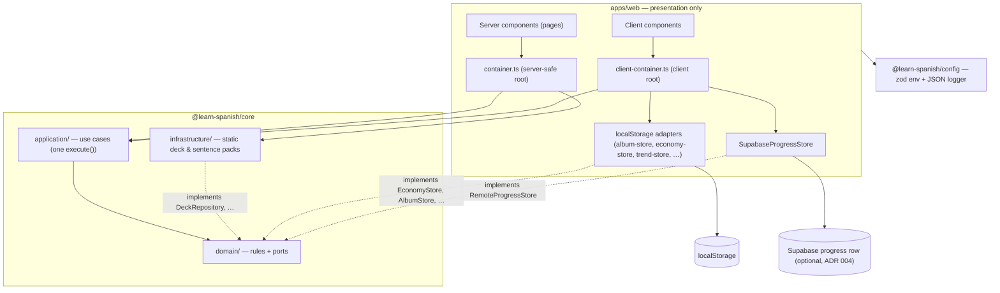
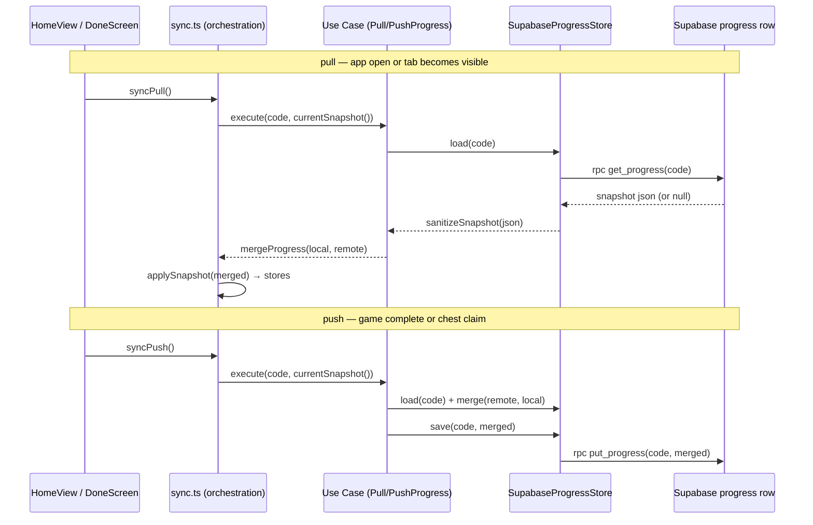

# Architecture diagrams

The system on one page: how the monorepo layers fit, how a sync exchange
flows, and where every byte of on-device state lives. Kept current with the
code (see `/diagram`); a wrong diagram is worse than none.

## The monorepo

Presentation calls use cases through two composition roots; every rule lives in
core behind ports; adapters own the storage. Solid edges are calls, dotted
edges are "implements a `domain/` port".

## A sync exchange (ADR 004)

Local-first: reads never wait on the network. The app pulls on open (and when
the tab becomes visible again) and pushes on game complete; every remote
payload passes the sanitizer before the additive merge, so nothing malformed
or destructive can come in.

Concurrent pushes are last-write-wins on the row and self-heal on the next
exchange — recorded, with the options for changing it, in the ADR 004
addendum.

## localStorage key inventory

Everything the app persists on a device. "Synced" means the value rides the
`ProgressSnapshot` (cross-device sync and the transfer code); per-device
pointers and presentation choices deliberately do not (ADR 004). Schema moves
between keys happen only in `storage-migrations.ts`.

| Key | Owner | Holds | Synced |
| --- | --- | --- | --- |
| `palabras.kid.v1` | `lib/kid.ts` | which kid is selected on this device | no (pointer) |
| `palabras.avatars.v1` | `lib/kid.ts` | each kid's chosen avatar | yes |
| `palabras.album.v1` | `lib/album-store.ts` | earned sticker ids | yes |
| `palabras.streaks.v1` | `lib/streak-store.ts` | daily ☀️ streak per kid | yes |
| `palabras.word-stats.v1` | `lib/word-stats-store.ts` | right/wrong tallies per word | yes |
| `palabras.stars.v1` | `lib/economy-store.ts` | ⭐ wallet per kid | yes |
| `palabras.mission.v1` | `lib/economy-store.ts` | today's misión state | yes |
| `palabras.pets.v2` | `lib/economy-store.ts` | pet collections | yes |
| `palabras.pet.v1` | migration source only | legacy single pet | legacy |
| `palabras.sticker-counts.v1` | `lib/economy-store.ts` | completion counts (tiers) | yes |
| `palabras.owned-avatars.v1` | `lib/economy-store.ts` | bought avatars | yes |
| `palabras.owned-accessories.v1` | `lib/economy-store.ts` | wardrobe ownership | yes |
| `palabras.unlocks.v1` | `lib/economy-store.ts` | secret-deck unlocks | yes |
| `palabras.weekly.v1` | `lib/economy-store.ts` | 🔥 weekly streak | yes |
| `palabras.week-progress.v1` | `lib/economy-store.ts` | this week's active days | yes |
| `palabras.freezes.v1` | `lib/economy-store.ts` | ❄️ escudos | yes |
| `palabras.category-awards.v1` | `lib/economy-store.ts` | claimed chest tiers per deck | yes |
| `palabras.reto.v1` | `lib/economy-store.ts` | best reto scores | no (per-device) |
| `palabras.trend.v1` | `lib/trend-store.ts` | weekly learned-words samples | no (derived from synced stats) |
| `palabras.sync.v1` | `lib/sync.ts` | the pairing code (capability key) | no (device pairing) |
| `palabras.theme.v1` / `palabras.owned-themes.v1` | `lib/theme.ts` | paper theme selection/ownership | no (per-device look) |
| `palabras.migrations.v1` | `lib/storage-migrations.ts` | applied migration ids | no (device bookkeeping) |
